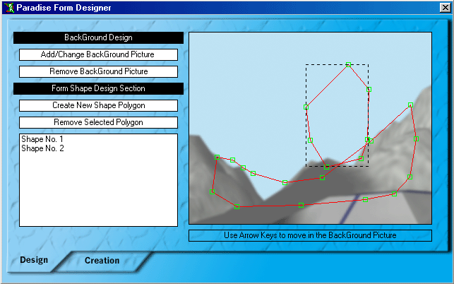



## Paradise Form Designer  \(MUST SEE\!\!\)

### Description

All of the Window Shape Designers Get Away! Here the Paradise Form Designer Comes! Why? Because using this program, you can also modify the shape you have designed! You Design your shape and give form properties you want to this program and it will automatically creates the form your want! An easy-to-use utility!
 
### More Info
 

             |
---                |---
**Submitted On**   |2002-02-01 18:25:44
**By**             |[Hesan Feghhi](https://github.com/Planet-Source-Code/PSCIndex/blob/master/ByAuthor/hesan-feghhi.md)
**Level**          |Advanced
**User Rating**    |4.9 (54 globes from 11 users)
**Compatibility**  |VB 5\.0, VB 6\.0
**Category**       |[Complete Applications](https://github.com/Planet-Source-Code/PSCIndex/blob/master/ByCategory/complete-applications__1-27.md)
**World**          |[Visual Basic](https://github.com/Planet-Source-Code/PSCIndex/blob/master/ByWorld/visual-basic.md)
**Archive File**   |[Paradise\_F52235212002\.zip](https://github.com/Planet-Source-Code/hesan-feghhi-paradise-form-designer-must-see__1-31379/archive/master.zip)

